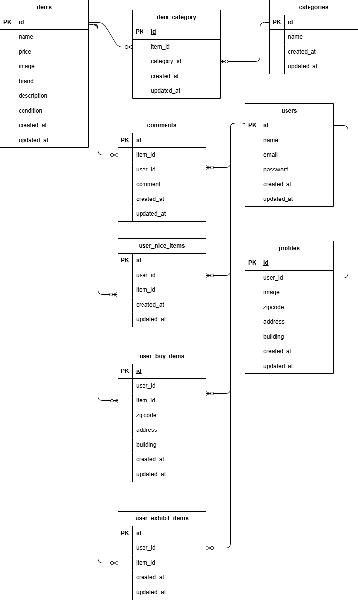

# フリマ

## 環境構築
### Dockerビルド
1. git clone リンク
1. docker-compose up -d --build
### Laravel 環境構築
1. docker-compose exec php bash
1. composer require laravel/fortify
1. composer require laravel-lang/lang:~7.0 --dev
1. composer install
1. .env.exampleファイルから.envを作成し、環境変数を変更
1. php artisan key:generate
1. php artisan migrate
1. php artisan db:seed
1. chmod -R 777 storage bootstrap/cache
1. php artisan storage:link
## 使用技術（実行環境）
PHP 8.1.33 
Laravel Framework 8.83.8
Ubuntu 24.04.2 LTS (on WSL)
nginx:1.21.1
## ER図

## URL
- ユーザー登録: http//localhost/register
- 開発環境: http://localhost
