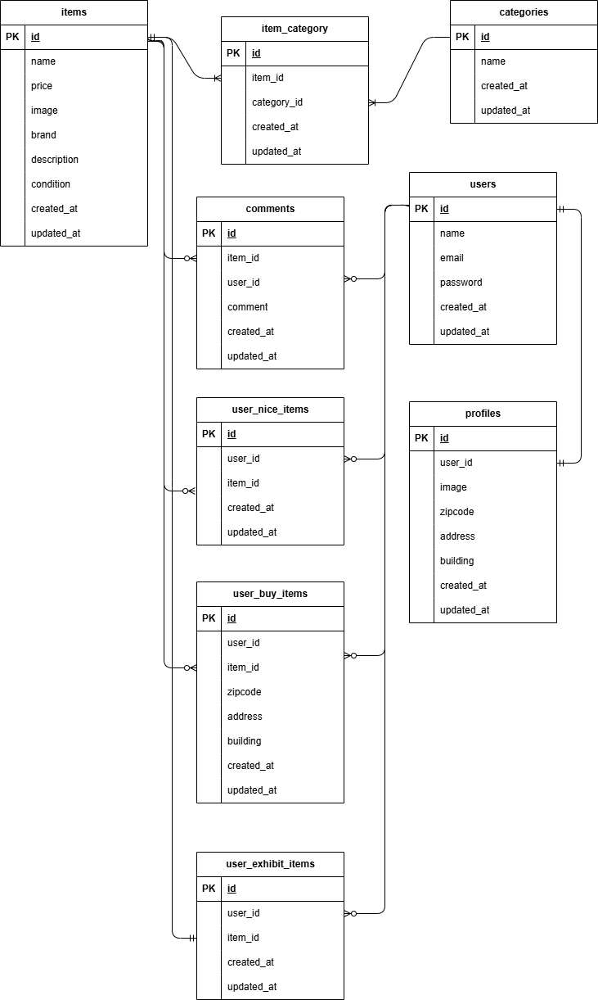

# フリマ

## 環境構築
### Dockerビルド
1. git clone リンク
1. docker-compose up -d --build
### Laravel 環境構築
1. docker-compose exec php bash
1. composer install
1. .env.exampleファイルから.envを作成し、環境変数を変更
```
// 前略

DB_CONNECTION=mysql
- DB_HOST=127.0.0.1
+ DB_HOST=mysql
DB_PORT=3306
- DB_DATABASE=laravel
- DB_USERNAME=root
- DB_PASSWORD=
+ DB_DATABASE=laravel_db
+ DB_USERNAME=laravel_user
+ DB_PASSWORD=laravel_pass

// 後略
```
4. php artisan key:generate
1. php artisan migrate
1. php artisan db:seed
1. chmod -R 777 storage bootstrap/cache
1. php artisan storage:link

ここまで通常の環境設定です。

9. ユーザー情報
name  email             password
test1 test1@example.com coachtech111
test2 test2@example.com coachtech112
test3 test3@example.com coachtech113

10. テスト手順は機能要件の機能詳細に準ずる

#### Laravel Feature test 環境構築
ここからは追加でFeatureTest とDustTest の環境構築の記述になります。

FeatureTest は以下を追加します。
1. docker-compose exec php bash
1. composer install
1. テスト用データーベースの準備
```
MySQL コンテナに入る
$ docker-compose exec mysql bash
$ mysql -u root -p
> CREATE DATABASE demo_test;
> SHOW DATABASES;
> exit;
$ exit
```

4. src/config/database.php の編集(FeatureTest で用いるデーターベースの設定)
```database.php
'mysql' => [
// 中略
],

+ 'mysql_test' => [
+             'driver' => 'mysql',
+             'url' => env('DATABASE_URL'),
+             'host' => env('DB_HOST', '127.0.0.1'),
+             'port' => env('DB_PORT', '3306'),
+             'database' => 'demo_test',
+             'username' => 'root',
+             'password' => 'root',
+             'unix_socket' => env('DB_SOCKET', ''),
+             'charset' => 'utf8mb4',
+             'collation' => 'utf8mb4_unicode_ci',
+             'prefix' => '',
+             'prefix_indexes' => true,
+             'strict' => true,
+             'engine' => null,
+             'options' => extension_loaded('pdo_mysql') ? array_filter([
+                 PDO::MYSQL_ATTR_SSL_CA => env('MYSQL_ATTR_SSL_CA'),
+             ]) : [],
+ ],
```
5. .env.example をコピーして.env.testing を作成する
```
cp src/.env.example src/.env.testing
```
6. .env.testing ファイルの始めのAPP_ENV と APP_KEY を編集する
```
APP_NAME=Laravel
- APP_ENV=local
+ APP_ENV=testing
APP_DEBUG=true
APP_URL=http://localhost
```
7. .env.testing に データベースの接続情報を追加する。
```
  DB_CONNECTION=mysql_test
- DB_HOST=120.0.0.1
+ DB_HOST=mysql
  DB_PORT=3306
- DB_DATABASE=laravel
  DB_USERNAME=root
- DB_PASSWORD=
+ DB_DATABASE=demo_test
  DB_USERNAME=root
+ DB_PASSWORD=root
```

PHPコンテナ上 でAPP_KEY に新たなテスト用アプリケーションキーを追加する

8. php artisan key:generate --env=testing
1. php artisan config:clear
1. php artisan migrate --env=testing
1. php artisan db:seed --env=testing
1. chmod -R 777 storage bootstrap/cache
1. php artisan storage:link
1. 最後に、テスト用データベースでテストを実行するために`src/phpunit.xml` を編集します。
```
<?xml version="1.0" encoding="UTF-8"?>
<phpunit xmlns:xsi="http://www.w3.org/2001/XMLSchema-instance"
xsi:noNamespaceSchemaLocation="./vendor/phpunit/phpunit/phpunit.xsd"
bootstrap="vendor/autoload.php"
colors="true"
>
<testsuites>
    <testsuite name="Unit">
        <directory suffix="Test.php">./tests/Unit</directory>
    </testsuite>
    <testsuite name="Feature">
        <directory suffix="Test.php">./tests/Feature</directory>
    </testsuite>
</testsuites>
<coverage processUncoveredFiles="true">
    <include>
        <directory suffix=".php">./app</directory>
    </include>
</coverage>
    <php>
        <server name="APP_ENV" value="testing"/>
        <server name="BCRYPT_ROUNDS" value="4"/>
        <server name="CACHE_DRIVER" value="array"/>
-         <!-- <server name="DB_CONNECTION" value="sqlite"/> -->
-         <!-- <server name="DB_DATABASE" value=":memory:"/> -->
+         <server name="DB_CONNECTION" value="mysql_test"/>
+         <server name="DB_DATABASE" value="demo_test"/>
        <server name="MAIL_MAILER" value="array"/>
        <server name="QUEUE_CONNECTION" value="sync"/>
        <server name="SESSION_DRIVER" value="array"/>
        <server name="TELESCOPE_ENABLED" value="false"/>
    </php>
</phpunit>
```
ここまでが、FeatureTest の環境構築手順です。
テストは以下のコマンドで実行します
```
$ php artisan test --env=testing
```

#### Laravel Dust test 環境構築
ここからは、DustTest の環境設定です。
1. docker-compose exec php bash
1. composer install
1. テスト用データーベースの準備
```
MySQL コンテナに入る
$ docker-compose exec mysql bash
$ mysql -u root -p
> CREATE DATABASE demo_test;
> SHOW DATABASES;
```
4. .env.example から.env.dusk.local をcopy して編集する
```
cp src/.env.example src/.env.dusk.local
```

5. .env.dusk.local ファイルの始めのAPP_ENV と APP_KEY, APP_URL  を編集する。
```
APP_NAME=Laravel
- APP_ENV=local
+ APP_ENV=testing
APP_DEBUG=true
- APP_URL=http://localhost
+ APP_URL=http://nginx

+ DUSK_DRIVER_URL=http://selenium:4444/wd/hub
```
6. .env.dusk.local に データベースの接続情報を追加する。
```
  DB_CONNECTION=mysql_test
  DB_HOST=mysql
  DB_PORT=3306
- DB_DATABASE=laravel
  DB_USERNAME=root
- DB_PASSWORD=laravel_pass
+ DB_DATABASE=demo_test
  DB_USERNAME=root
+ DB_PASSWORD=root
```

APP_KEY に新たなテスト用アプリケーションキーを追加する。以下データベースのテーブル作成とシーディングを行う時には`--env=dusk.local` を追加する。

7. php artisan key:generate --env=dusk.local
1. php artisan migrate --env=dusk.local
1. php artisan db:seed --env=dusk.local
1. chmod -R 777 storage bootstrap/cache
1. php artisan storage:link
1. php artisan dusk:install
1. 作成されたtests/DuskTestCase.php の owner を変更する
```
chown 1000:1000 tests/DuskTestCase.php
```
14. src/tests/DuskTestCase.php を編集
```
prepare() 関数の中身をcomment out
    public static function prepare()
    {
!        // if (! static::runningInSail()) {
!        //     static::startChromeDriver();
!        // }
    }
option を追加
            return $items->merge([
                '--disable-gpu',
                '--headless',
+               '--no-sandbox',
+               '--disable-dev-shm-usage',
	]);
```

15. Dusk テストでは、chrome を介してテストを行うので、.env.dusk.local と同じ内容の.env を用意する。
```
cp src/.env.dusk.local src/.env
```

16. テスト用データベースでテストを実行するために`src/phpunit.xml` を編集します。
```
<?xml version="1.0" encoding="UTF-8"?>
<phpunit xmlns:xsi="http://www.w3.org/2001/XMLSchema-instance"
xsi:noNamespaceSchemaLocation="./vendor/phpunit/phpunit/phpunit.xsd"
bootstrap="vendor/autoload.php"
colors="true"
>
<testsuites>
    <testsuite name="Unit">
        <directory suffix="Test.php">./tests/Unit</directory>
    </testsuite>
    <testsuite name="Feature">
        <directory suffix="Test.php">./tests/Feature</directory>
    </testsuite>
</testsuites>
<coverage processUncoveredFiles="true">
    <include>
        <directory suffix=".php">./app</directory>
    </include>
</coverage>
    <php>
        <server name="APP_ENV" value="testing"/>
        <server name="BCRYPT_ROUNDS" value="4"/>
        <server name="CACHE_DRIVER" value="array"/>
-         <!-- <server name="DB_CONNECTION" value="sqlite"/> -->
-         <!-- <server name="DB_DATABASE" value=":memory:"/> -->
+         <server name="DB_CONNECTION" value="mysql_test"/>
+         <server name="DB_DATABASE" value="demo_test"/>
        <server name="MAIL_MAILER" value="array"/>
        <server name="QUEUE_CONNECTION" value="sync"/>
        <server name="SESSION_DRIVER" value="array"/>
        <server name="TELESCOPE_ENABLED" value="false"/>
    </php>
</phpunit>
```

17. テストは以下のコマンドで実行します
```:PHPコンテナ内
$ php artisan dusk --env=dusk.local
```

## 使用技術（実行環境）
1. PHP 8.1.33 
1. Laravel Framework 8.83.8
1. Ubuntu 24.04.2 LTS (on WSL)
1. nginx:1.21.1
1. mailhog
1. PHPUnit
1. selenium
1. dusk
## ER図

## URL
- ユーザー登録: http//localhost/register
- 開発環境: http://localhost
